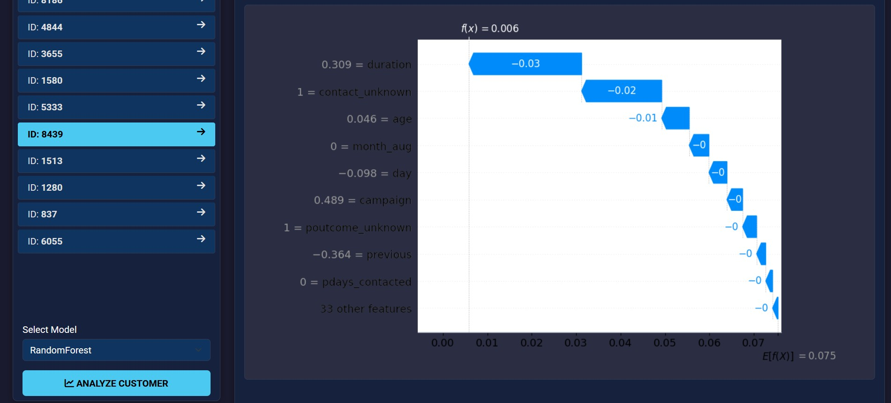
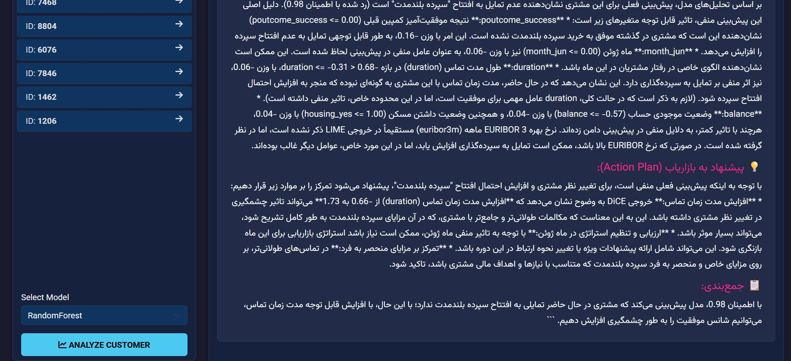

# Explain-Banker.ai
### Explainable AI for Smart Banking Decisions

##  Overview
**Explain-Banker.ai** is an advanced intelligent dashboard designed for the banking sector to predict customer behavior (Term Deposit Subscription) and, more importantly, **explain why**.

Unlike traditional *black-box* AI models, this project leverages **Explainable AI (XAI)** techniques to provide transparency, trust, and actionable insights for bank managers and marketers.  
By integrating **Generative AI (Google Gemini)**, complex mathematical explanations are translated into **human-readable business reports in Persian (Farsi)**.

## Key Features
### 1. Predictive Modeling
- Utilizes powerful machine learning models:
  - **Random Forest**
  - **Support Vector Machine (SVM)**
  - **MLP (Neural Networks)**
- Predicts whether a client will subscribe to a **term deposit** using demographic and transactional data.

### 2. Explainability (XAI)
- **SHAP (Global & Local Impact):**  
  Visualizes how features such as *Call Duration* or *Euribor Rate* push predictions toward **Yes** or **No**.
- **LIME (Local Explanation):**  
  Explains the model’s decision for a **specific individual customer**.
- **DiCE (Counterfactual Explanations):**  
  Answers *“What-if?”* questions, such as:  
  > *What minimal changes would make this customer subscribe?*  
  *(e.g., increasing call duration by 30 seconds)*

### 3. AI Consultant (LLM Integration)
- Powered by **Google Gemini 2.5 Flash**
- Analyzes XAI outputs and generates:
  - **Professional business reports**
  - **Actionable marketing recommendations**
- Bridges the gap between **data science** and **business decision-making**

## Tech Stack
- **Backend:** Python, Flask  
- **Frontend:** HTML5, CSS3, Bootstrap 5 (High-Contrast Dark Mode)  
- **Machine Learning:** Scikit-learn, TensorFlow / Keras  
- **XAI Libraries:** SHAP, LIME, DiCE  
- **LLM:** Google Generative AI (Gemini)

##  Dataset
This project uses the **Bank Marketing Data Set**  
*(Moro et al., 2014)* from the **UCI Machine Learning Repository**.

**Inputs:**  
Age, job, marital status, economic indicators (Euribor, CPI), call duration, etc.

**Output:**  
Binary classification — **Term Deposit Subscription (Yes / No)**

---

##  Screenshots

### 1. Dashboard & Prediction

### 2. SHAP Waterfall Plot

### 3. AI Consultant (Persian Report)

## Citation

If you use this dataset or methodology, please cite:

**Moro et al., 2014**  
S. Moro, P. Cortez, P. Rita  
*A Data-Driven Approach to Predict the Success of Bank Telemarketing*  
Decision Support Systems, Elsevier, 62:22–31, June 2014.

## Connect with Me

To see my other projects or get in touch, feel free to check out my profiles:

  

❤️ Built with Passion for AI Transparency